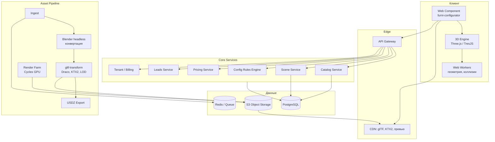

# Техническое задание: SaaS-платформа 3D-конфигурации и планирования мебели

**Версия:** 1.0 · **Дата:** 08.09.2026 · **Статус:** к обсуждению

---

## 0. Как читать документ

Разделы 1–3 — продуктовая рамка и главные развилки, которые нужно закрыть до старта разработки. Разделы 4–13 — собственно ТЗ. Раздел 14 — оценка реализации силами Claude Code и Claude Design. Разделы 15–17 — риски, метрики, дорожная карта.

Допущения, сделанные при написании (проверить и скорректировать):

- Целевой клиент — мебельный ритейлер или производитель с каталогом 500–20 000 SKU, а не студия дизайна интерьера.
- Основной сценарий монетизации — подписка магазина, а не оплата конечным покупателем.
- Первичный рынок — RU/CIS, с прицелом на экспортную версию (EN/EU).

---

## 1. Продукт: что именно строим

### 1.1 Суть

Мультитенантный SaaS, который даёт мебельному магазину три вещи:

1. **Конфигуратор товара** — покупатель на карточке товара меняет размеры, модули, ткани, фурнитуру и видит результат в 3D с корректной ценой.
2. **Планировщик помещения** — покупатель рисует свою комнату и расставляет в ней мебель из каталога этого магазина.
3. **Конвертацию** — из полученной сцены рождается заявка/корзина/КП в PDF, которая падает менеджеру со всей спецификацией.

Для магазина это не «красивая 3D-игрушка», а инструмент снижения возвратов и увеличения среднего чека. Всё ТЗ подчинено этой мысли: любая фича, которая не влияет на заявку, — в бэклог.

### 1.2 Роли

| Роль | Кто | Ключевые задачи |
|---|---|---|
| **Конечный покупатель** | Аноним на сайте магазина | Сконфигурировать, спланировать, поделиться, оставить заявку |
| **Менеджер магазина** | Продавец в салоне | Открыть сцену клиента, доработать, выставить КП |
| **Контент-менеджер** | Сотрудник магазина | Загрузить модели, привязать к SKU, настроить правила и цены |
| **Админ тенанта** | Владелец/маркетолог | Брендирование, пользователи, интеграции, аналитика |
| **Оператор платформы** | Мы | Тенанты, тарифы, модерация, мониторинг, контент-фабрика |

### 1.3 Что НЕ входит в продукт (явные границы)

- Не CAD для производства (раскрой, присадка, ЧПУ-выгрузка) — это отдельный рынок, где сидят Базис и K3.
- Не универсальный редактор интерьеров с чужим контентом — работаем только с каталогом тенанта.
- Не фотореалистичный рендер уровня V-Ray в реальном времени на телефоне. Фотореализм — отдельным серверным заданием (см. 6.4).

---

## 2. Рынок и позиционирование (краткий анализ)

**Кто уже есть:**

- *Roomle, Cylindo (Scandinavian), Threekit, 3D Cloud by Marxent* — западные SaaS-конфигураторы, дорогие, плохо адаптированы под RU-каталоги и 1С.
- *Configura CET* — тяжёлый десктоп для контрактной мебели.
- *Базис-Мебельщик, PRO100, K3-Мебель* — производственный CAD, десктоп, устаревший UX, не встраивается в интернет-магазин.
- *Planner 5D, Homestyler* — B2C-планировщики с чужим контентом, не решают задачу магазина.

**Свободная ниша:** лёгкий, быстрый, встраиваемый в карточку товара конфигуратор для среднего мебельного ритейла RU/CIS, с интеграцией в 1С/Битрикс/InSales и адекватной ценой (не $2–5к/мес).

**Ключевой дифференциатор, который надо защищать:** скорость запуска для магазина. Если конкурент внедряется 4 месяца силами интегратора, а мы — за 2 недели с самообслуживанием, это и есть продукт. Отсюда критическая важность **фабрики контента** (раздел 6), а не движка рендера.

> **Главный вывод анализа:** узкое место бизнеса — не 3D-движок, а конвейер превращения мебели клиента в оптимизированные 3D-ассеты. Движок пишется один раз. Контент — каждый день, для каждого нового клиента. Половина инженерного бюджета должна уйти именно туда.

---

## 3. Три архитектурные развилки (решить до кода)

### Развилка A: статичные меши vs параметрическая генерация

| | Статичные glTF на каждый SKU | Параметрическая сборка из деталей |
|---|---|---|
| Скорость старта | Высокая | Низкая (нужен движок сборки) |
| Каталог 10 000 SKU | Невозможно (10 000 моделей) | Реально (200 деталей + правила) |
| Шкаф «любая ширина» | Не поддерживается | Нативно |
| Нагрузка на CDN | Огромная | Минимальная |

**Рекомендация — гибрид:**
- *Класс «фиксированный товар»* (кресло, стул, светильник) — статичный оптимизированный glTF.
- *Класс «параметрический товар»* (шкафы, кухни, модульные диваны, стеллажи) — библиотека деталей + декларативные правила сборки, геометрия генерируется на клиенте из примитивов с процедурным UV.

Это самая дорогая часть системы и одновременно главный технологический ров. Закладывать в архитектуру с первого дня, реализовывать во второй фазе.

### Развилка B: реальное время vs пре-рендер

Требование «красивый современный дизайн» на телефоне физически конфликтует с реальным временем: мобильный GPU не даст мягкие тени, GI и качественные материалы при 60 fps.

**Решение — три уровня визуализации:**

1. **Interactive (WebGL2)** — во время перетаскивания: запечённое освещение, IBL, blob-тени, упрощённые материалы. Цель — 60 fps.
2. **Refined (WebGL2, отложенный)** — через 400 мс после остановки взаимодействия: включаем контактные тени, SSAO, TAA, более высокий LOD. Пользователь видит, как картинка «дозревает».
3. **Photoreal (сервер)** — по кнопке «Получить фото интерьера»: Blender Cycles на GPU-инстансе, 20–60 сек, результат в PDF/на почту.

Это даёт и скорость, и «вау» без компромисса.

### Развилка C: iframe vs Web Component для встраивания

**Рекомендация:** обёртка — Web Component (`<furni-configurator sku="...">`), внутри — sandboxed iframe. Custom element даёт чистый API, атрибуты и события для интеграции с корзиной магазина; iframe гарантирует изоляцию CSS/JS и защиту от конфликтов с легаси-темами Битрикса.

---

## 4. Функциональные требования

### 4.1 Модуль «Конфигуратор товара» (FR-CFG)

| ID | Требование | Приоритет |
|---|---|---|
| FR-CFG-01 | Загрузка виджета по SKU без перезагрузки страницы магазина | P0 |
| FR-CFG-02 | Переключение опций (материал, цвет, размер, комплектация) с мгновенным откликом в 3D | P0 |
| FR-CFG-03 | Пересчёт цены и артикула в реальном времени по правилам тенанта | P0 |
| FR-CFG-04 | Правила совместимости: недопустимые комбинации блокируются и объясняются | P0 |
| FR-CFG-05 | Просмотр 360°, зум, фиксированные ракурсы (фас/бок/сверху) | P0 |
| FR-CFG-06 | Крупный план материала (макро-режим ткани/шпона) | P1 |
| FR-CFG-07 | AR-примерка: WebXR на Android, USDZ Quick Look на iOS | P1 |
| FR-CFG-08 | Сохранение конфигурации в короткую ссылку + QR | P0 |
| FR-CFG-09 | Передача конфигурации в корзину магазина (JS-событие + webhook) | P0 |
| FR-CFG-10 | Экспорт спецификации в PDF с ценами и превью | P1 |

### 4.2 Модуль «Планировщик помещения» (FR-PLN)

| ID | Требование | Приоритет |
|---|---|---|
| FR-PLN-01 | Рисование плана: прямоугольник по двум размерам либо произвольный контур | P0 |
| FR-PLN-02 | Стены, двери, окна, ниши, колонны, радиаторы | P0 |
| FR-PLN-03 | Ввод размеров с клавиатуры (не только мышью) — критично для точности | P0 |
| FR-PLN-04 | Пресеты типовых планировок (студия, П-44Т, евродвушка) | P2 |
| FR-PLN-05 | Импорт плана из фото/скана как подложки с калибровкой по одной стене | P2 |
| FR-PLN-06 | Каталог тенанта с фасетным поиском внутри планировщика | P0 |
| FR-PLN-07 | Drag & drop с магнитным примагничиванием к стенам и соседям | P0 |
| FR-PLN-08 | Проверка коллизий и зон открывания дверей/ящиков | P1 |
| FR-PLN-09 | Переключение 2D/3D, режим «от первого лица» | P0 |
| FR-PLN-10 | Отделка: стены, пол, потолок из библиотеки материалов | P1 |
| FR-PLN-11 | Undo/redo не менее 50 шагов | P0 |
| FR-PLN-12 | Автосохранение каждые 10 с и восстановление после обрыва связи | P0 |
| FR-PLN-13 | Спецификация сцены: список позиций, сумма, кнопка «Оформить» | P0 |
| FR-PLN-14 | Шаринг сцены по ссылке в режиме «только просмотр» / «можно править» | P1 |
| FR-PLN-15 | Совместное редактирование менеджером и клиентом в реальном времени | P2 |

### 4.3 Модуль «Кабинет магазина» (FR-ADM)

| ID | Требование | Приоритет |
|---|---|---|
| FR-ADM-01 | Загрузка моделей (FBX, OBJ, glTF, 3DS, SKP) с автообработкой | P0 |
| FR-ADM-02 | Статус обработки модели с превью и отчётом об оптимизации | P0 |
| FR-ADM-03 | Привязка модели к SKU, категориям, ценам | P0 |
| FR-ADM-04 | Редактор материалов и вариантов (ткани, цвета, текстуры) | P0 |
| FR-ADM-05 | Визуальный редактор правил конфигурации (без кода) | P1 |
| FR-ADM-06 | Брендирование виджета: логотип, палитра, шрифт, радиусы | P0 |
| FR-ADM-07 | Синхронизация каталога: CSV/XLSX, YML, REST, 1С:Обмен | P1 |
| FR-ADM-08 | Управление пользователями и правами | P1 |
| FR-ADM-09 | Аналитика: воронка, топ-конфигурации, брошенные сцены, время в сессии | P1 |
| FR-ADM-10 | Лиды: список заявок со сценами, статусы, выгрузка в CRM | P0 |

### 4.4 Модуль «Платформа» (FR-PLT)

| ID | Требование | Приоритет |
|---|---|---|
| FR-PLT-01 | Регистрация тенанта, триал 14 дней, тарифы, биллинг | P0 |
| FR-PLT-02 | Квоты: число моделей, трафик CDN, серверные рендеры | P0 |
| FR-PLT-03 | Публичный REST API + webhooks | P1 |
| FR-PLT-04 | Кастомный домен виджета для тенанта | P2 |
| FR-PLT-05 | Панель оператора: тенанты, задачи пайплайна, инциденты | P1 |

---

## 5. Системная архитектура



### 5.1 Мультитенантность

- Одна БД, `tenant_id` во всех таблицах, **PostgreSQL Row-Level Security** как страховка от ошибки в коде.
- Ассеты в S3 по префиксу `tenants/{tenant_id}/`, доступ через подписанные URL для приватных, публичный CDN-путь для опубликованных.
- Изоляция по схемам — только для enterprise-клиентов, требующих этого договором. Не делать по умолчанию: убивает миграции.

### 5.2 Модель данных (ключевые сущности)

```
tenants          id, slug, plan, branding_json, limits_json
users            id, tenant_id, role, auth_provider
products         id, tenant_id, sku, name, category, base_price, type(static|parametric)
assets           id, tenant_id, product_id, kind(mesh|texture|usdz|thumb),
                 uri, lod_level, bytes, tri_count, checksum
materials        id, tenant_id, name, pbr_json, tiling, price_modifier
option_groups    id, product_id, code, ui_type, required
options          id, group_id, code, label, price_delta, sku_suffix, asset_ref
rules            id, product_id, dsl_json          -- совместимость и параметрика
scenes           id, tenant_id, owner_session, doc_jsonb, version, preview_uri
leads            id, tenant_id, scene_id, contact_json, total, status
render_jobs      id, tenant_id, scene_id, status, params_json, result_uri
```

`scenes.doc_jsonb` — документ сцены, версионируемый. Формат — собственный JSON со ссылками на SKU и трансформациями; **не** хранить геометрию в сцене.

---

## 6. Конвейер 3D-ассетов (критический модуль)

### 6.1 Этапы

1. **Ingest.** Приём FBX/OBJ/SKP/3DS/glTF, антивирус, лимит 500 МБ, дедупликация по checksum.
2. **Нормализация (Blender headless, Python API).** Единицы → метры, ось Y-up, origin в геометрический низ-центр, применение модификаторов, разбор иерархии, разделение на именованные части.
3. **Санитария меша.** Слияние вершин, удаление невидимой внутренней геометрии, пересчёт нормалей, тримминг вырожденных треугольников.
4. **Децимация и LOD.** LOD0 (оригинал ≤ бюджета), LOD1 (50%), LOD2 (20%), LOD3 (impostor-биллборд).
5. **UV и текстуры.** Перепаковка UV при необходимости, запекание AO в отдельный канал, атласирование мелких материалов.
6. **Компрессия.** Геометрия — Meshopt (предпочтительно) или Draco. Текстуры — **KTX2/Basis Universal** с транскодированием в ASTC/ETC2/BC7 по устройству. Это даёт кратное падение GPU-памяти против PNG/JPEG и напрямую влияет на мобильную производительность.
7. **Экспорты.** glTF 2.0 (основной), USDZ (iOS AR), WebP-превью 4 ракурса, спрайт-360 (36 кадров) как fallback для слабых устройств.
8. **Валидация.** Автопроверка бюджетов (см. 7.2). При превышении — задача не публикуется, контент-менеджер видит конкретную причину.

### 6.2 Требования к пайплайну

- Полностью асинхронный, очередь с приоритетами, идемпотентность по checksum.
- Время обработки одной модели среднего размера — **≤ 3 минуты** (P95).
- Повторный прогон всего каталога тенанта одной командой (при смене версии пайплайна).
- Ручной режим: контент-менеджер может переопределить автоматические решения (какие части резать, какой LOD).

### 6.3 Библиотека деталей для параметрики

Формат описания параметрического изделия — декларативный JSON:

```json
{
  "type": "wardrobe",
  "params": { "width": {"min": 600, "max": 3000, "step": 50},
              "height": {"min": 1800, "max": 2700, "step": 50},
              "depth": {"enum": [450, 600]} },
  "assembly": [
    { "part": "side_panel", "count": 2, "place": "edges", "material": "$carcass" },
    { "part": "shelf", "count": "floor(width/400)", "distribute": "vertical",
      "constraint": "span <= 800" },
    { "part": "door", "count": "ceil(width/600)", "material": "$facade",
      "hardware": "$handle" }
  ],
  "rules": [
    { "if": "width > 2400 && depth == 450", "then": "add:middle_stiffener" },
    { "if": "facade.type == 'glass'", "forbid": "handle.type == 'push'" }
  ]
}
```

Геометрия собирается на клиенте в Web Worker, кэшируется по хешу параметров. Цена считается на сервере (нельзя доверять клиенту), но предварительная оценка показывается мгновенно локально.

### 6.4 Ферма фотореалистичного рендера

- Blender Cycles, GPU-инстансы (spot/preemptible), автоскейлинг от 0.
- Пресеты освещения: «дневной свет», «вечер», «студия».
- Очередь с квотами по тарифу, SLA — 90 секунд P95 для 2K, 5 минут для 4K.
- Результат: изображение + вотермарка на бесплатном тарифе, чистое — на платном.

---

## 7. Требования к производительности

Это раздел с наивысшим приоритетом. Любое требование ниже — приёмочное, проверяется автоматически в CI на реальных устройствах (device farm), а не «на глаз».

### 7.1 Эталонные устройства

| Класс | Устройство | Требование |
|---|---|---|
| Low | Xiaomi Redmi 9A / iPhone SE 2020 | ≥ 30 fps, деградация качества допустима |
| Mid (**целевой**) | Redmi Note 12 / iPhone 12 / iPad 9 | **60 fps** |
| High | iPad Pro M-серии, флагманы Android | 60 fps + refined-режим |
| Desktop | Ноутбук с интегрированной графикой | 60 fps на 1440p |

### 7.2 Бюджеты

| Метрика | Mobile | Tablet | Desktop |
|---|---|---|---|
| Треугольников в кадре | ≤ 250 000 | ≤ 600 000 | ≤ 1 500 000 |
| Draw calls | ≤ 80 | ≤ 150 | ≤ 300 |
| Текстурная память GPU | ≤ 120 МБ | ≤ 250 МБ | ≤ 600 МБ |
| Размер одной модели (сжатой) | ≤ 1.5 МБ | ≤ 2.5 МБ | ≤ 4 МБ |
| Уникальных материалов в сцене | ≤ 25 | ≤ 40 | ≤ 80 |

### 7.3 Метрики загрузки и отклика

| Метрика | Целевое значение | Условия замера |
|---|---|---|
| JS-шелл до первого взаимодействия | ≤ 60 КБ gzip | — |
| Чанк 3D-движка (ленивый) | ≤ 500 КБ gzip | — |
| TTFF (первый кадр 3D) | ≤ 2.0 с | 4G, mid-устройство, холодный кэш |
| Время смены материала | ≤ 100 мс | текстура в кэше |
| Время добавления объекта в сцену | ≤ 400 мс | модель не в кэше |
| INP | ≤ 200 мс | все интерактивы |
| CLS виджета на странице магазина | ≤ 0.02 | зарезервированное место |
| Загрузка сцены на 30 объектов | ≤ 3.5 с | 4G |
| Влияние виджета на LCP страницы | 0 | до клика движок не грузится |

### 7.4 Обязательные приёмы оптимизации

- **Прогрессивная загрузка:** сначала LOD2 всей сцены, затем LOD0 для объектов в фокусе камеры.
- **Instancing** для повторяющихся объектов (стулья, модули).
- **Frustum + occlusion culling**; для планировщика — отсечение по комнатам.
- **Запечённое освещение**, никаких real-time shadow maps на мобильных. Контактные тени — только в refined-режиме.
- **Разделение состояния:** состояние сцены живёт в мутабельном сторе вне реактивности Vue; Vue рендерит только UI-хром. Ни одного обновления компонента на кадр анимации или на кадр перетаскивания.
- **Обязательно `markRaw` на все объекты Three.js.** Vue оборачивает вложенные объекты в Proxy, и попадание `Object3D`, `BufferGeometry`, `Material` или `Texture` в `reactive()` или в состояние Pinia убивает производительность на порядок: каждое обращение к `.position.x` в цикле рендера проходит через перехватчик. Правило: любая ссылка на объект сцены — только через `markRaw()` или `shallowRef()`. Это проверяется линт-правилом и код-ревью, а не «на память».
- **OffscreenCanvas + Worker** для рендера там, где поддерживается; фолбэк на основной поток.
- **Ленивая инициализация виджета:** до клика по постеру грузится только шелл и статичная картинка.
- **Кэш ассетов:** Service Worker + Cache Storage, инвалидация по checksum в имени файла (immutable).
- **Адаптивное качество:** runtime-детект GPU-класса (время первых кадров + `WEBGL_debug_renderer_info`), автоматическое понижение pixel ratio, отключение пост-эффектов, снижение LOD-порогов.
- **Термальная деградация:** при устойчивом падении fps ниже 45 в течение 5 с — снижение качества на ступень без уведомления пользователя.

---

## 8. UX для тач-устройств

Планировщик на телефоне — главный источник провалов у конкурентов. Требования:

### 8.1 Карта жестов

| Жест | 2D-план | 3D-вид |
|---|---|---|
| Один палец, drag по пустому месту | Панорама | Орбита камеры |
| Один палец, drag по объекту | Перемещение объекта | Перемещение по полу (raycast) |
| Тап по объекту | Выделение + панель действий | То же |
| Два пальца, pinch | Зум | Зум (dolly) |
| Два пальца, drag | Панорама | Панорама |
| Два пальца, вращение | Поворот плана | Орбита по азимуту |
| Долгий тап | Контекстное меню | Контекстное меню |
| Двойной тап | Вписать в экран | Фокус на объекте |

**Принцип:** прямое перетаскивание объекта разрешено только после выделения. До выделения любой drag — это камера. Это устраняет главную ошибку — случайное смещение мебели при попытке покрутить сцену.

### 8.2 Требования к тач-взаимодействию

- Минимальная зона касания элемента управления — **44×44 CSS px**, для 3D-хэндлов — 56×56.
- Магнитное примагничивание: к стенам (0 мм), к соседним объектам (0 мм), к сетке 50 мм, к осям. Порог срабатывания — 12 px экрана, не мировых единиц.
- Хэндлы трансформации выносятся за габарит объекта, не перекрывая его.
- Тактильный отклик (Vibration API) на срабатывание примагничивания и на недопустимое действие.
- Все панели — bottom sheet с тремя позициями (peek / half / full), а не боковые сайдбары.
- Каталог на телефоне — горизонтальная лента карточек поверх сцены, не отдельный экран.
- Никаких hover-зависимых интерфейсов.
- Точный ввод размеров: тап по размерной линии открывает числовое поле. Это обязательно — пальцем до миллиметра не попасть.
- Отмена действия — крупная плавающая кнопка, всегда доступна.
- Ориентация: работает и в портрете, и в ландшафте; в портрете 3D-вьюпорт занимает верхние 60%.

### 8.3 Стилус

На iPad с Apple Pencil — режим точного рисования плана: перо рисует стены, палец панорамирует. Определять по `PointerEvent.pointerType`.

---

## 9. Дизайн-система и визуальный язык

### 9.1 Принципы

- **Интерфейс уходит, сцена остаётся.** Хром минимален, полупрозрачен, при взаимодействии со сценой панели ужимаются.
- **Тёмный вьюпорт, светлый UI-хром** (или наоборот по брендингу тенанта) — мебель на нейтральном фоне читается лучше.
- Никаких «3D-редакторских» интерфейсов с гизмо-кубами и деревом сцены. Референс — приложение камеры, а не Blender.
- Скорость как часть эстетики: skeleton-состояния, оптимистичные обновления, анимации 150–250 мс с `ease-out`, ни одного спиннера дольше 1 с без прогресса.

### 9.2 Токены

```
--radius: 12px / 16px / 24px
--space: 4 8 12 16 24 32 48
--font: Inter / SF Pro (system stack), tabular-nums для размеров
--elevation: 3 уровня, мягкие тени, без границ
--motion: 150ms micro / 250ms panel / 400ms scene
--brand-*: переопределяется тенантом (primary, surface, accent)
```

### 9.3 Брендирование тенанта

Тенант задаёт: логотип, `primary`, `accent`, радиус, шрифт (из белого списка). Всё остальное — фиксировано платформой, чтобы не разрушить UX. Превью брендинга в кабинете в реальном времени.

### 9.4 Доступность

WCAG 2.1 AA для UI-хрома: контраст, фокус-кольца, клавиатурная навигация по каталогу и настройкам, `prefers-reduced-motion`. 3D-сцена — с текстовой альтернативой (список объектов и их расположение).

---

## 10. Стек

| Слой | Выбор | Обоснование |
|---|---|---|
| Рендер | **Three.js** (императивно в горячем пути) + **TresJS** для декларативного каркаса сцены | Three.js остаётся ядром; TresJS даёт компонентную обёртку без потери контроля над бюджетами. Babylon.js тяжелее на старте |
| Графика API | WebGL2 базово, **WebGPU** как прогрессивное улучшение | WebGPU даёт compute для параметрики, но покрытие ещё неполное |
| UI | **Vue 3.5** (Composition API, `<script setup>`) + TypeScript + Vite | Vite — родной инструмент экосистемы Vue, сборка и HMR быстрее из коробки |
| Стили | Tailwind + CSS-переменные для токенов тенанта | Runtime-темизация без пересборки |
| Компоненты | **Reka UI** (бывш. Radix Vue) + собственная библиотека | Доступность из коробки, headless — не мешает брендированию тенанта |
| Состояние UI | **Pinia** | Стандарт экосистемы, хорошая типизация |
| Состояние сцены | Мутабельный стор вне реактивности Vue: `shallowRef` + обязательный `markRaw` на объекты Three.js | Vue-прокси на `Object3D` — главный источник просадок; см. 7.4 |
| Воркеры | Comlink | Геометрия, коллизии, парсинг |
| Бэкенд | **NestJS (TypeScript)** | Общие типы с фронтом, скорость разработки; Go — только если упрёмся в нагрузку |
| Пайплайн | Python + Blender bpy, Node + gltf-transform, meshoptimizer | Стандарт индустрии |
| Очередь | BullMQ + Redis | Простота; переезд на SQS при росте |
| БД | PostgreSQL 16 + RLS + JSONB | Сцены как документы, каталог как реляция |
| Хранилище | S3-совместимое + CDN с edge-кэшем | — |
| Реалтайм | WebSocket (совместное редактирование, статусы задач) | — |
| Аутентификация | Auth.js / Keycloak для админов; анонимные сессии для покупателей | — |
| Наблюдаемость | OpenTelemetry, Sentry, **собственная телеметрия fps/GPU** | Без клиентской телеметрии производительности продукт неуправляем |
| Инфраструктура | Kubernetes или Nomad, IaC в Terraform | — |
| CI/CD | GitHub Actions + device farm для перф-тестов | — |

### 10.1 Оговорка по 3D-экосистеме Vue

Экосистема Vue вокруг Three.js заметно моложе, чем React-овая: у TresJS есть аналог drei (Cientos), но покрытие хелперов меньше, а часть готовых решений (продвинутые контролы, пост-эффекты, загрузчики) придётся писать самим поверх голого Three.js.

Для этого проекта риск умеренный по архитектурной причине: **горячий путь и так вынесен за пределы фреймворка**. Требование 7.4 запрещает держать сцену в реактивном состоянии, значит перетаскивание, снаппинг, коллизии, LOD-переключения и цикл рендера — это чистый императивный Three.js, одинаковый в любом фреймворке. TresJS отвечает только за монтирование сцены, привязку к жизненному циклу компонента и декларативное описание статичной части. Слой тонкий и заменяемый.

Правила, снижающие риск:

- Вся работа с Three.js — в composables (`useScene`, `useSelection`, `useSnapping`), не в компонентах. Компоненты — только монтирование и UI.
- Любой недостающий хелпер портируется из drei как собственная утилита, а не тянется как зависимость.
- Слой TresJS изолирован одним модулем; при необходимости заменяется на ручное монтирование Three.js без переписывания логики сцены.

---

## 11. Встраиваемый виджет

### 11.1 API интеграции

```html
<script src="https://cdn.example.com/embed.js" async></script>

<furni-configurator
  tenant="mebel-store"
  sku="SOFA-2100-GR"
  mode="product"
  theme="auto"
  lazy="poster">
</furni-configurator>
```

```js
const el = document.querySelector('furni-configurator');

el.addEventListener('config:change', e => {
  // { sku, price, options, previewUrl }
});

el.addEventListener('cart:add', e => {
  shopCart.add(e.detail.sku, e.detail.qty, e.detail.configId);
});

await el.open();                    // программное открытие
await el.setOption('fabric', 'F12');
```

### 11.2 Требования

- `embed.js` ≤ 8 КБ gzip, без зависимостей, работает при отключённых модулях.
- До взаимодействия — статичный постер с зарезервированной высотой (CLS = 0).
- Полная изоляция стилей; никаких глобальных стилей на страницу магазина.
- CSP-совместимость, работа в Shadow DOM.
- Fallback при отсутствии WebGL: спрайт-360 + список опций.
- Домены-разрешения (allowlist) на уровне тенанта против воровства виджета.

---

## 12. Безопасность и данные

- Все цены и правила валидируются на сервере; клиентский расчёт — только для отклика UI.
- Подписанные URL для приватных ассетов, TTL 15 минут.
- Rate limiting на конфигурации, рендеры и создание сцен (защита от абуза квот).
- Персональные данные — только в модуле лидов; сцены анонимны до момента заявки. Соответствие 152-ФЗ, хранение ПДн в РФ для российских тенантов.
- Аудит-лог действий в кабинете тенанта.
- Экспорт и удаление данных тенанта по запросу (портируемость).

---

## 13. Нефункциональные требования

| Категория | Требование |
|---|---|
| Доступность сервиса | 99.5% API, 99.9% CDN |
| Масштаб | 1000 тенантов, 10 000 одновременных сцен |
| Восстановление | RPO 15 мин, RTO 2 ч |
| Локализация | RU / EN с первого дня, архитектура под добавление языков |
| Браузеры | Chrome/Edge 110+, Safari 16.4+, Firefox 115+, Samsung Internet 21+ |
| Офлайн | Открытая сцена остаётся редактируемой при обрыве связи, синхронизация при восстановлении |
| Мониторинг | Клиентская телеметрия: fps p50/p95, TTFF, ошибки WebGL, класс устройства — с разбивкой по тенантам |

---

## 14. Оценка реализации силами Claude Code и Claude Design

Оценка практическая: где инструменты дают реальное ускорение, где — нет, и что всё равно потребует человека.

### 14.1 Claude Design

Подходит для визуального слоя и работы «до кода»: макеты экранов кабинета и планировщика, дизайн-система и токены, состояния компонентов, лендинг и маркетинговые страницы, прототипы мобильных компоновок и bottom sheet, варианты брендирования виджета. Результат — материал, который можно итеративно править разговором и сразу отдавать в разработку.

Чего от него ждать не стоит: проектирования жестовых взаимодействий с реальным 3D (это проверяется только на устройстве), точной анимационной хореографии сцены, дизайна под конкретные перф-ограничения (сколько слоёв прозрачности потянет Redmi).

**Вывод:** закрывает примерно 70% дизайн-работ по продукту, кроме той части, где дизайн неотделим от рендера.

### 14.2 Claude Code по модулям

| Модуль | Пригодность | Комментарий |
|---|---|---|
| Каркас приложения, роутинг, сборка | Высокая | Рутина, делается быстро |
| Кабинет тенанта (CRUD, таблицы, формы) | Высокая | Самый выгодный участок автоматизации |
| Бэкенд: API, схема БД, миграции, RLS | Высокая | Требует ревью политик безопасности |
| Асset-пайплайн: скрипты Blender, gltf-transform, очереди | Высокая | Хорошо ложится: это скриптовая работа с чёткими критериями |
| Правила конфигурации: DSL, парсер, валидатор | Высокая | Формализуемая задача |
| Компоненты сцены на TresJS / Three.js | Средняя | Код пишется, но перф-профиль нужно мерить руками. Примеров Three.js под Vue в обучающих данных меньше, чем под React — чаще выдаёт React-паттерны, нужен явный контекст проекта |
| Параметрическая генерация геометрии | Средняя | 3D-математика требует внимательного ревью и тестов на геометрию |
| Жесты, снаппинг, коллизии на тач | Низкая–средняя | Пишется быстро, доводится долго и только на устройствах |
| Шейдеры, оптимизация GPU-памяти, борьба за кадры | Низкая | Нужен инженер с опытом realtime-графики |
| Квирки iOS Safari (WebXR, USDZ, память) | Низкая | Только эмпирика на реальных айфонах |
| Инфраструктура, Terraform, CI | Высокая | — |
| Тесты: unit, интеграционные, e2e | Высокая | Один из лучших сценариев применения |

### 14.3 Что даёт наибольший эффект

Практика, которая окупается в этом проекте:

1. **Жёсткая спецификация перед кодом.** Этот документ — уже половина работы. Чем точнее бюджеты и критерии приёмки, тем меньше итераций.
2. **Автотесты производительности в CI.** Сценарий: Playwright гоняет сцену, снимает fps и число draw calls, падает при выходе за бюджет. Такой тест писать долго руками, но он делается быстро с ассистентом и защищает главное требование проекта.
3. **Кодогенерация пайплайна.** Скрипты Blender и gltf-transform — классическая задача с быстрым циклом обратной связи.
4. **Ревью и рефакторинг** узких мест по профилям, снятым с реальных устройств.

### 14.4 Реалистичная оценка сроков

Команда: 1 сильный фулстек + 1 инженер по realtime-графике + 0.5 дизайнера + 1 контент-оператор (с фазы 1).

| Фаза | Содержание | Срок |
|---|---|---|
| **0. Технический прототип** | Пайплайн на 5 реальных моделях клиента, рендер на 4 эталонных устройствах, замер бюджетов. **Гейт: 60 fps на mid — иначе пересмотр архитектуры** | 2–3 нед |
| **1. MVP** | Конфигуратор статичных товаров, виджет, кабинет, лиды, биллинг. Один пилотный магазин | 8–10 нед |
| **2. Планировщик** | 2D/3D-план, тач-UX, спецификация, шаринг, AR | 6–8 нед |
| **3. Параметрика** | Библиотека деталей, DSL, генерация геометрии — шкафы и кухни | 8–10 нед |
| **4. Масштабирование** | Интеграции 1С/Битрикс, аналитика, ферма рендера, самообслуживание | 6–8 нед |

Итого до коммерчески полноценного продукта — **7–9 месяцев**. Без ассистентов сопоставимая команда потратила бы 12–16 месяцев; экономия достигается на фазах 1 и 4, почти не достигается на фазе 0 и в графической части фазы 3.

Актуальную информацию по инструментам: [Claude Code](https://docs.claude.com/en/docs/claude-code/overview), [Claude API](https://docs.claude.com/en/api/overview).

---

## 15. Риски

| Риск | Вероятность | Влияние | Митигация |
|---|---|---|---|
| Не удержим 60 fps на mid-устройствах | Средняя | Критическое | Фаза 0 как гейт; готовый план деградации до спрайт-360 |
| Контент клиента непригоден (нет 3D или ужасное качество) | **Высокая** | Критическое | Ручная контент-фабрика как услуга; прайс за модель; не обещать полную автоматизацию |
| Долгий цикл продажи в мебельном ритейле | Высокая | Высокое | Триал с 10 бесплатно оцифрованными SKU как крючок |
| Сложность интеграции с 1С у каждого клиента | Высокая | Среднее | Начать с CSV/YML, 1С — во второй фазе, через типовые обмены |
| iOS-ограничения по памяти WebGL | Средняя | Высокое | Жёсткий бюджет текстур, агрессивная выгрузка неиспользуемых ассетов |
| Конкурент демпингует | Средняя | Среднее | Дифференциация по скорости внедрения, не по цене |

**Главный риск — не технический, а контентный.** Заложить в бизнес-модель платную оцифровку каталога и штат/подряд 3D-моделлеров.

---

## 16. Метрики успеха и критерии приёмки

### 16.1 Продуктовые

- Конверсия сессии с конфигуратором в заявку ≥ 2× относительно обычной карточки товара.
- Доля сессий с мобильных ≥ 60%, отказ (bounce) в виджете ≤ 25%.
- Время оцифровки каталога нового клиента: 100 SKU за ≤ 5 рабочих дней.
- Time-to-value тенанта (регистрация → первый работающий виджет) ≤ 14 дней.

### 16.2 Технические (приёмочные)

Релиз не принимается, если на эталонных устройствах не выполнено:

- 60 fps p50 и ≥ 45 fps p95 на mid при сцене из 20 объектов.
- TTFF ≤ 2.0 с на 4G.
- INP ≤ 200 мс.
- Влияние на LCP страницы магазина = 0.
- Автоматический перф-тест в CI зелёный.

---

## 17. Ближайшие шаги

1. Подтвердить или скорректировать допущения раздела 0 и развилки раздела 3.
2. Получить 5–10 реальных 3D-моделей от потенциального клиента — это вход в фазу 0.
3. Собрать технический прототип и замерить бюджеты на реальных устройствах **до** любой работы над кабинетом, биллингом и лендингом.
4. Параллельно — дизайн-концепт планировщика на телефоне и планшете, потому что именно он определит, взлетит продукт или нет.
